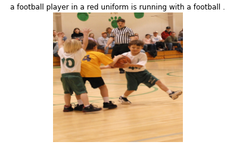
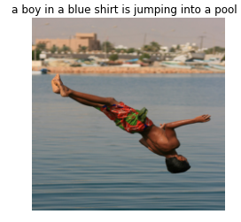

# Image Captioning

Image captioning is an application of deep learning which describe the content of an image in words. In this project I uses Resnet architecture as backone to 
create embedding for Images and LSTM for generating capsions.
This project is an implementation of paper entitled "image captioning" by Vikram Mullachery et al.

## Dataset
We use flickr8K dataset for training and inference that has 5 captions for each traing image: 
https://www.kaggle.com/adityajn105/flickr8k  

## Preprocessing
multiple preprocess method are used for image and text part:

- Resizeing and Normalization of images
- Creating Dictioanry with respect to captions of each image
- Adding start and end tokens to the caption
- assigning an index to words

After preprocess step we embed the captions and images.

## Architecture
The two following architecture are used in training and testing the model.

## Training
we compare resualt with three different methods:
- Freezing the resnet part, excpet the last layer (transfer learning).
- Unfreezing the resent part and train it.
- Using Bi-LSTM for generaating captions.

## Resualts

A sample of resualts:

