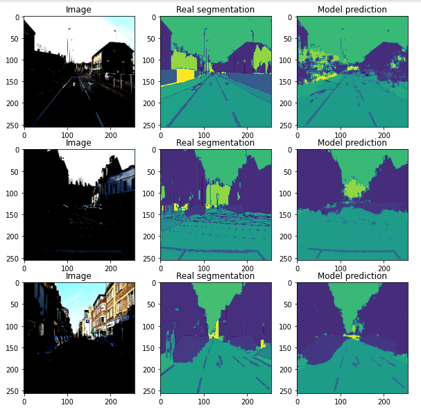

# Semantic Segmentation

Semantic segmentation task assign a class label to each pixel in an image resulting is an image that is segmented by each object.
In this project, the Segnet network have been implemented which was introduced in the paper entitled "SegNet: A Deep Convolutional Encoder-Decoder Architecture for Image Segmentation" by Vijay Badrinarayanan et al. 

## Dataset

We use Camvid dataset for trainig and inference:  
https://s3.amazonaws.com/fast-ai-imagelocal/camvid.tgz  
http://mi.eng.cam.ac.uk/research/projects/VideoRec/CamVid/data/LabeledApproved_full.zip  

## Preprocessing:

multiple preprocess method are used 
- resizing images
- creating codecs (labels) for each pixels
- one hot encoding for label of pixels

## Architecture

the following architecture is Segnet:
 
Segnet has 13 Encoder/Decoder layers.In this project we implemeted SegnetBase architecture which is similar to segent architecture unless it has 4 Encode/Decoder.

## Training

Two different method have been implemented:
- Network with batch Normalization 
- Network without batch Normalization

## Resualts

A sample of resualts:

resualts without batch normalization:  

resualts with batch normalization:  

